# 🤖 ARE (Autonomous Revenue Engine) Agent Graph

## Executive Summary

This agent graph represents the complete orchestration framework for Rekindle Pro's Autonomous Revenue Engine. The system features **hierarchical agent orchestration** where core "brainstem" agents coordinate specialized revenue, optimization, and strategic agents to create a self-driving revenue optimization machine.

## Architecture Overview

```mermaid
graph TB
    %% Core Brainstem Agents (Central Nervous System)
    subgraph "🧠 CORE BRAINSTEM"
        PLANNER[Planner Agent<br/>Goal → Subgoal → Task → Tool]
        EXECUTOR[Executor Agent<br/>Tool Execution & Action]
        CRITIC[Critic Agent<br/>Quality Assessment & Learning]
        GUARDRAIL[Guardrail Agent<br/>Policy Enforcement & Safety]
        RAG[Knowledge/RAG Agent<br/>Context & Memory Retrieval]
    end

    %% Revenue Agents (Primary Business Logic)
    subgraph "💰 REVENUE AGENTS"
        REVIVAL[Revival Agent<br/>Dead Pipeline Reactivation]
        SEQUENCING[Sequencing Agent<br/>Multi-touch Campaign Orchestration]
        COPY[Copy Agent<br/>Personalized Content Generation]
        RESEARCH[Research Agent<br/>Lead Intelligence & Enrichment]
        PERSONALIZATION[Personalization Agent<br/>Dynamic ICP Matching]
        MULTITOUCH[Multi-touch Agent<br/>Channel Optimization]
    end

    %% Optimization Agents (Continuous Improvement)
    subgraph "📈 OPTIMIZATION AGENTS"
        SEND_TIME[Send-Time Bandit<br/>Optimal Timing Optimization]
        COPY_BANDIT[Copy Bandit<br/>A/B Testing & Iteration]
        COHORT_BANDIT[Cohort Bandit<br/>Segment Performance]
        AUTONOMY_CALIBRATOR[Autonomy Calibrator<br/>Risk-Adjusted Scaling]
        ANOMALY_DETECTOR[Anomaly Detector<br/>Performance Monitoring]
    end

    %% Strategic Agents (Long-term Intelligence)
    subgraph "🎯 STRATEGIC AGENTS"
        ICP_BUILDER[ICP Builder<br/>Dynamic Customer Profiling]
        FORECASTER[Forecaster<br/>Revenue Prediction Engine]
        LEAKAGE_DETECTOR[Leakage Detector<br/>Revenue Loss Prevention]
        RISK_SENTINEL[Risk Sentinel<br/>Compliance & Risk Monitoring]
        CHURN_PREDICTOR[Churn Predictor<br/>Retention Intelligence]
    end

    %% Data & Memory Layer
    subgraph "🗄️ MEMORY & DATA"
        VECTOR_STORE[(Vector Store<br/>RAG Knowledge Base)]
        OUTCOME_STORE[(Outcome Store<br/>Results & Feedback)]
        EVENT_STREAM{{Event Stream<br/>Real-time Signals}}
        SHORT_TERM[Short-term Memory<br/>Per-agent Context]
        LONG_TERM[Long-term Memory<br/>Historical Patterns]
    end

    %% External Systems Integration
    subgraph "🔗 EXISTING SYSTEMS"
        CREWAI[(CrewAI Agents<br/>28 Specialized Agents)]
        REX_ORCH[(REX Orchestrator<br/>Task Management)]
        AUTONOMOUS_SERVICES[(Autonomous Services<br/>Revival, Forecasting, etc.)]
        TELEMETRY[(Telemetry Pipeline<br/>Behaviour Intelligence)]
    end

    %% Core Orchestration Flow
    PLANNER --> EXECUTOR
    EXECUTOR --> CRITIC
    CRITIC --> PLANNER
    GUARDRAIL -.->|Policy Check| PLANNER
    GUARDRAIL -.->|Policy Check| EXECUTOR
    RAG -.->|Context| PLANNER
    RAG -.->|Context| EXECUTOR

    %% Revenue Agent Coordination
    PLANNER --> REVIVAL
    PLANNER --> SEQUENCING
    PLANNER --> COPY
    PLANNER --> RESEARCH
    PLANNER --> PERSONALIZATION
    PLANNER --> MULTITOUCH

    REVIVAL --> RESEARCH
    SEQUENCING --> COPY
    SEQUENCING --> MULTITOUCH
    COPY --> PERSONALIZATION

    %% Optimization Agent Integration
    EXECUTOR --> SEND_TIME
    EXECUTOR --> COPY_BANDIT
    EXECUTOR --> COHORT_BANDIT
    EXECUTOR --> AUTONOMY_CALIBRATOR
    EXECUTOR --> ANOMALY_DETECTOR

    CRITIC --> COPY_BANDIT
    CRITIC --> AUTONOMY_CALIBRATOR
    CRITIC --> ANOMALY_DETECTOR

    %% Strategic Agent Oversight
    PLANNER --> ICP_BUILDER
    PLANNER --> FORECASTER
    PLANNER --> LEAKAGE_DETECTOR
    PLANNER --> RISK_SENTINEL
    PLANNER --> CHURN_PREDICTOR

    FORECASTER --> LEAKAGE_DETECTOR
    ICP_BUILDER --> PERSONALIZATION
    RISK_SENTINEL --> GUARDRAIL

    %% Memory & Learning Integration
    CRITIC --> OUTCOME_STORE
    ANOMALY_DETECTOR --> OUTCOME_STORE
    LEAKAGE_DETECTOR --> OUTCOME_STORE

    VECTOR_STORE --> RAG
    OUTCOME_STORE --> RAG
    SHORT_TERM --> CRITIC
    LONG_TERM --> PLANNER

    %% Event Stream Integration
    EVENT_STREAM --> ANOMALY_DETECTOR
    EVENT_STREAM --> LEAKAGE_DETECTOR
    EVENT_STREAM --> RISK_SENTINEL
    EVENT_STREAM --> CHURN_PREDICTOR

    %% Existing Systems Integration
    EXECUTOR --> CREWAI
    EXECUTOR --> REX_ORCH
    EXECUTOR --> AUTONOMOUS_SERVICES

    CREWAI --> OUTCOME_STORE
    REX_ORCH --> OUTCOME_STORE
    AUTONOMOUS_SERVICES --> OUTCOME_STORE

    TELEMETRY --> EVENT_STREAM
    TELEMETRY --> VECTOR_STORE

    %% Styling
    classDef coreAgents fill:#e1f5fe,stroke:#01579b,stroke-width:2px
    classDef revenueAgents fill:#f3e5f5,stroke:#4a148c,stroke-width:2px
    classDef optimizationAgents fill:#e8f5e8,stroke:#1b5e20,stroke-width:2px
    classDef strategicAgents fill:#fff3e0,stroke:#e65100,stroke-width:2px
    classDef dataLayer fill:#fafafa,stroke:#616161,stroke-width:1px
    classDef externalSystems fill:#ffebee,stroke:#b71c1c,stroke-width:2px

    class PLANNER,EXECUTOR,CRITIC,GUARDRAIL,RAG coreAgents
    class REVIVAL,SEQUENCING,COPY,RESEARCH,PERSONALIZATION,MULTITOUCH revenueAgents
    class SEND_TIME,COPY_BANDIT,COHORT_BANDIT,AUTONOMY_CALIBRATOR,ANOMALY_DETECTOR optimizationAgents
    class ICP_BUILDER,FORECASTER,LEAKAGE_DETECTOR,RISK_SENTINEL,CHURN_PREDICTOR strategicAgents
    class VECTOR_STORE,OUTCOME_STORE,EVENT_STREAM,SHORT_TERM,LONG_TERM dataLayer
    class CREWAI,REX_ORCH,AUTONOMOUS_SERVICES,TELEMETRY externalSystems
```



## Agent Categories & Responsibilities

### 🧠 Core Brainstem Agents

| Agent | Function | Integration Points |
|-------|----------|-------------------|
| **Planner** | Hierarchical goal decomposition, task planning, resource allocation | All revenue/optimization/strategic agents |
| **Executor** | Tool execution, action implementation, workflow orchestration | CrewAI agents, REX orchestrator, autonomous services |
| **Critic** | Quality assessment, outcome evaluation, learning signal generation | Outcome store, bandit agents, anomaly detection |
| **Guardrail** | Policy enforcement, safety validation, compliance checking | All agents, risk sentinel |
| **Knowledge/RAG** | Context retrieval, memory access, pattern recognition | Vector store, outcome store, all agents |

### 💰 Revenue Agents

| Agent | Function | Key Workflows |
|-------|----------|---------------|
| **Revival Agent** | Dead pipeline reactivation, trigger detection, personalized outreach | Research → Copy → Send-Time optimization |
| **Sequencing Agent** | Multi-touch campaign orchestration, channel sequencing, timing optimization | Multi-touch → Personalization → Send-Time |
| **Copy Agent** | Personalized content generation, A/B testing, conversion optimization | Personalization → Copy Bandit → Outcome analysis |
| **Research Agent** | Lead intelligence gathering, enrichment, signal detection | LinkedIn MCP, company data, trigger events |
| **Personalization Agent** | Dynamic ICP matching, content adaptation, relevance optimization | ICP Builder → Research → Copy |
| **Multi-touch Agent** | Cross-channel orchestration, attribution, effectiveness optimization | All channels → Sequencing → Analytics |

### 📈 Optimization Agents

| Agent | Function | Learning Mechanism |
|-------|----------|-------------------|
| **Send-Time Bandit** | Optimal send timing discovery, timezone optimization | Multi-armed bandit, outcome feedback |
| **Copy Bandit** | Content variant testing, winning copy identification | A/B testing, conversion metrics |
| **Cohort Bandit** | Segment performance optimization, audience targeting | Cohort analysis, revenue attribution |
| **Autonomy Calibrator** | Risk-adjusted autonomy scaling, confidence thresholding | Outcome tracking, risk assessment |
| **Anomaly Detector** | Performance monitoring, deviation alerting, automated correction | Statistical process control, threshold alerts |

### 🎯 Strategic Agents

| Agent | Function | Business Impact |
|-------|----------|----------------|
| **ICP Builder** | Dynamic customer profiling, market segmentation, opportunity identification | Revenue expansion, targeting accuracy |
| **Forecaster** | Revenue prediction, pipeline forecasting, scenario planning | Resource allocation, growth planning |
| **Leakage Detector** | Revenue loss prevention, bottleneck identification, automated fixes | Revenue recovery, efficiency gains |
| **Risk Sentinel** | Compliance monitoring, regulatory adherence, risk mitigation | Legal protection, operational safety |
| **Churn Predictor** | Customer retention intelligence, proactive intervention, lifecycle optimization | Revenue preservation, customer lifetime value |

## Data Flow Architecture

### Signal Ingestion
```
External Events → Event Stream → Anomaly Detector
                              → Leakage Detector
                              → Risk Sentinel
                              → Churn Predictor
```

### Planning & Execution Cycle
```
Planner → Executor → Tool/Action → Outcome Store → Critic → Learning → Planner
```

### Memory Integration
```
Short-term Memory: Per-agent context, active workflows
Long-term Memory: Historical patterns, learned behaviors
Vector Store: RAG knowledge base, semantic search
Outcome Store: Results tracking, feedback loops
```

## Integration with Existing Systems

### CrewAI Agents (28 Specialized Agents)
- **DeadLeadReactivationCrew**: Integrated with Revival Agent
- **FullCampaignCrew**: Orchestrated by Sequencing Agent
- **AutoICPCrew**: Enhanced by ICP Builder

### REX Orchestrator
- **Task Management**: Executor delegates complex workflows
- **Safety Services**: Guardrail integrates with REX safety monitors
- **Queue Management**: Executor uses Bull queues for scalability

### Autonomous Services
- **Revival Engine**: Revival Agent primary interface
- **Revenue Forecaster**: Forecaster agent integration
- **Leakage Detector**: Strategic agent coordination
- **Behaviour Intelligence**: Event stream and telemetry

## Agent Communication Protocols

### Message Types
- **Planning Messages**: Goal decomposition, task assignment
- **Execution Messages**: Tool calls, action requests
- **Feedback Messages**: Outcome reporting, quality assessment
- **Control Messages**: Policy enforcement, safety interventions

### Communication Patterns
- **Hierarchical**: Core agents coordinate specialized agents
- **Peer-to-Peer**: Revenue agents collaborate on campaigns
- **Event-Driven**: Optimization agents respond to outcomes
- **Broadcast**: Strategic insights shared across all agents

## Safety & Governance Integration

### Guardrail Enforcement Points
- **Pre-Planning**: Policy checks before goal decomposition
- **Pre-Execution**: Safety validation before tool calls
- **Post-Execution**: Outcome verification and compliance audit
- **Continuous Monitoring**: Risk sentinel integration

### Learning Safeguards
- **Outcome Validation**: Critic verifies feedback quality
- **Anomaly Detection**: Prevents learning from corrupted data
- **Gradual Rollout**: Autonomy calibrator manages risk exposure
- **Human Oversight**: Critical actions require approval

## Performance & Scalability

### Agent Deployment Model
- **Core Agents**: Always-on, high-availability
- **Revenue Agents**: On-demand scaling based on pipeline size
- **Optimization Agents**: Continuous background processing
- **Strategic Agents**: Scheduled and event-triggered

### Resource Management
- **Memory Limits**: Per-agent context boundaries
- **Rate Limiting**: Guardrail enforces operational constraints
- **Priority Queuing**: Critical tasks prioritized over optimization
- **Load Balancing**: Executor distributes work across instances

## Implementation Roadmap

### Phase 1: Core Infrastructure (Week 1-2)
1. Deploy core brainstem agents (Planner, Executor, Critic, Guardrail)
2. Implement basic agent communication framework
3. Connect to existing CrewAI and REX systems

### Phase 2: Revenue Orchestration (Week 3-4)
1. Deploy revenue agent suite
2. Implement campaign orchestration workflows
3. Integrate with outcome tracking and learning

### Phase 3: Optimization Layer (Week 5-6)
1. Deploy bandit optimization agents
2. Implement continuous learning loops
3. Add anomaly detection and alerting

### Phase 4: Strategic Intelligence (Week 7-8)
1. Deploy strategic agent suite
2. Implement predictive modeling and forecasting
3. Add comprehensive risk and compliance monitoring

### Phase 5: Full Autonomy (Week 9-12)
1. Connect all agent layers
2. Implement end-to-end autonomous workflows
3. Deploy gradual autonomy scaling with human oversight

## Success Metrics

### Technical Metrics
- **Agent Coordination**: 99.9% successful task completion
- **Response Time**: <100ms for planning decisions
- **Learning Accuracy**: >85% prediction accuracy
- **Safety Compliance**: 100% policy enforcement

### Business Metrics
- **Revenue Impact**: 25-40% pipeline acceleration
- **Operational Efficiency**: 60% reduction in manual work
- **Conversion Improvement**: 15-30% uplift from optimization
- **Risk Mitigation**: Zero compliance violations

---

**Status**: ✅ **ARCHITECTURE COMPLETE** | **Ready for Implementation**
**Next**: Code scaffolding for core brainstem agents