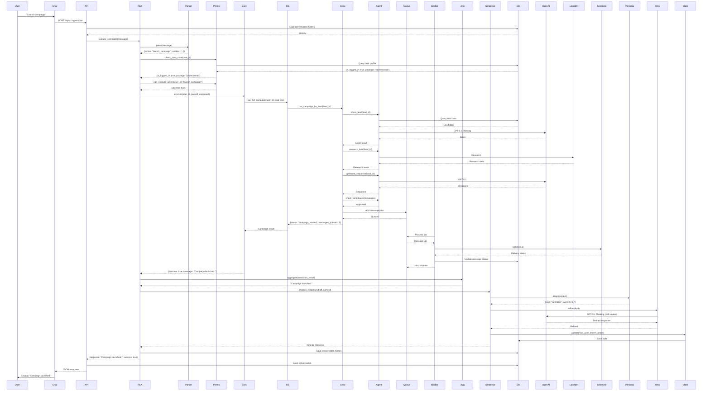
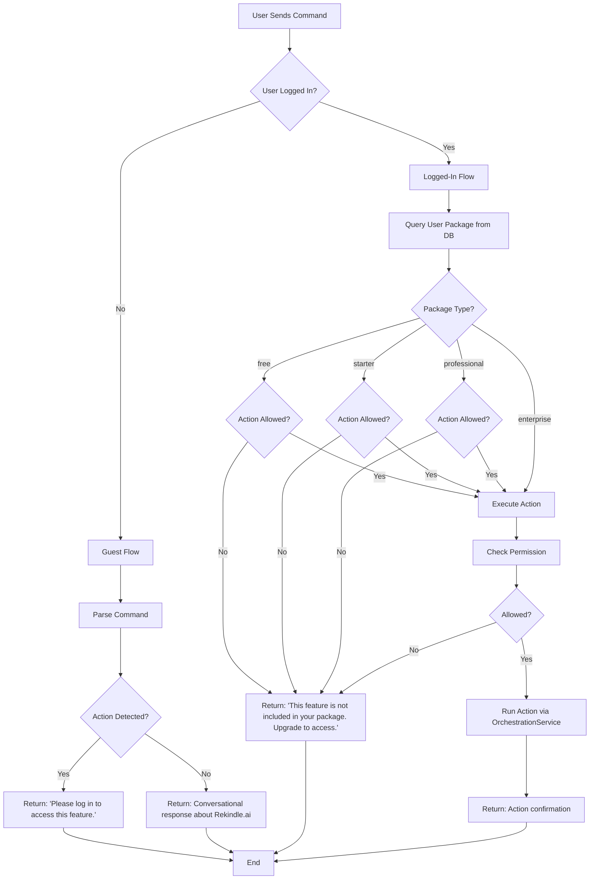
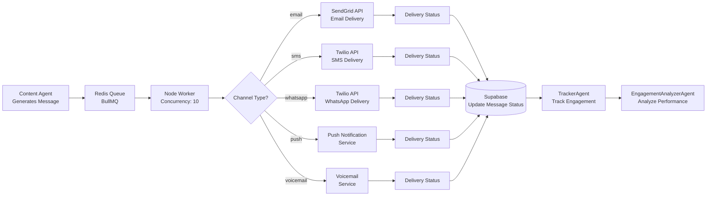
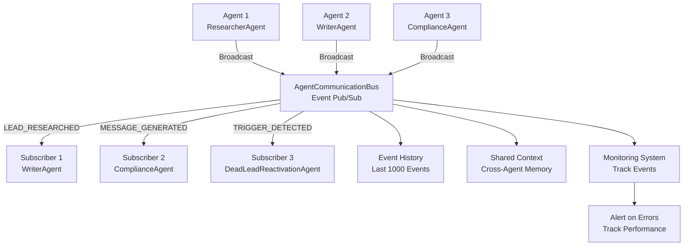

# Rekindle.ai System Workflow Diagram

## Visual Architecture Map

```mermaid
graph TB
    subgraph "Frontend Layer"
        UI[React App<br/>Landing Page / Dashboard]
        Chat[AIAgentWidget<br/>Chat Interface]
        Voice[Web Speech API<br/>Voice Input]
    end

    subgraph "API Gateway"
        API[FastAPI Server<br/>JWT Auth, Rate Limiting]
        WS[WebSocket<br/>Agent Activity]
    end

    subgraph "REX Orchestrator"
        REX[REX Main<br/>execute_command]
        Parser[CommandParser<br/>Regex + Intent]
        Perms[PermissionsManager<br/>Login + Package]
        Exec[ActionExecutor<br/>Delegation + Retry]
        Agg[ResultAggregator<br/>Response Formatting]
    end

    subgraph "Sentience Engine"
        State[StateManager<br/>Persistent State]
        Intent[IntentEngine<br/>Goal Alignment]
        Persona[PersonaAdapter<br/>Tone Adjustment]
        Intro[IntrospectionLoop<br/>Self-Review]
        Heal[SelfHealingLogic<br/>Error Recovery]
    end

    subgraph "Orchestration Service"
        OS[OrchestrationService<br/>Crew Coordinator]
        FC[FullCampaignCrew<br/>18 Agents]
        DL[DeadLeadReactivationCrew<br/>9 Agents]
        ICP[AutoICPCrew<br/>4 Agents]
        MI[MasterIntelligenceAgent<br/>Director]
    end

    subgraph "Agent Categories"
        Intel[Intelligence Agents<br/>Research, ICP, Scoring, Sourcing]
        Content[Content Agents<br/>Writer, Subject, FollowUp, Objection, Engagement]
        Safety[Safety Agents<br/>Compliance, Quality, RateLimit]
        Sync[Sync Agents<br/>Tracker, Synchronizer]
        Revenue[Revenue Agents<br/>MeetingBooker, Billing]
        Opt[Optimization Agents<br/>ABTest, Domain, Calendar, Competitor, Personalization]
        Infra[Infrastructure Agents<br/>EmailWarmup, Nurturing, ChurnPrevention]
        Analytics[Analytics Agents<br/>Market, Performance]
    end

    subgraph "Communication Layer"
        Bus[AgentCommunicationBus<br/>Event Pub/Sub]
        Monitor[Monitoring System<br/>Metrics + Alerts]
        Log[Agent Logging<br/>Execution Tracking]
    end

    subgraph "Message Queue"
        Redis[(Redis Queue<br/>BullMQ)]
        Worker[Node Worker<br/>SendGrid/Twilio]
    end

    subgraph "External Services"
        OpenAI[OpenAI GPT-5.1<br/>Instant/Thinking]
        SendGrid[SendGrid<br/>Email]
        Twilio[Twilio<br/>SMS/WhatsApp]
        LinkedIn[LinkedIn MCP<br/>Research]
    end

    subgraph "Data Layer"
        Supabase[(Supabase PostgreSQL<br/>RLS Enabled)]
        Tables[Tables:<br/>leads, campaigns, messages<br/>chat_history, rex_state, profiles]
    end

    %% User Flow - Logged In
    UI -->|User Command| Chat
    Chat -->|POST /api/v1/agent/chat| API
    Voice -->|Transcription| Chat
    
    %% API to REX
    API -->|JWT Auth| REX
    API -->|Background Tasks| OS
    
    %% REX Flow
    REX -->|Parse| Parser
    REX -->|Check| Perms
    REX -->|Execute| Exec
    REX -->|Aggregate| Agg
    REX -->|Process| Sentience
    
    %% Sentience Components
    Sentience --> State
    Sentience --> Intent
    Sentience --> Persona
    Sentience --> Intro
    Sentience --> Heal
    
    %% Permissions Check
    Perms -->|Query| Supabase
    
    %% Execution Flow
    Exec -->|Delegate| OS
    Exec -->|Retry Logic| Heal
    
    %% Orchestration to Crews
    OS --> FC
    OS --> DL
    OS --> ICP
    OS --> MI
    
    %% Crews to Agents
    FC --> Intel
    FC --> Content
    FC --> Safety
    FC --> Sync
    FC --> Revenue
    FC --> Opt
    FC --> Infra
    FC --> Analytics
    
    DL --> Intel
    DL --> Content
    DL --> Safety
    DL --> Sync
    
    ICP --> Intel
    
    %% Agent Communication
    Intel --> Bus
    Content --> Bus
    Safety --> Bus
    Sync --> Bus
    Revenue --> Bus
    Opt --> Bus
    Infra --> Bus
    Analytics --> Bus
    
    Bus --> Monitor
    Bus --> Log
    
    %% Agents to External Services
    Intel --> OpenAI
    Intel --> LinkedIn
    Content --> OpenAI
    Safety --> OpenAI
    
    %% Message Queue Flow
    Content -->|Queue Messages| Redis
    Redis -->|Process Jobs| Worker
    Worker -->|Send| SendGrid
    Worker -->|Send| Twilio
    Worker -->|Update| Supabase
    
    %% Data Access
    REX -->|Query| Supabase
    OS -->|Query| Supabase
    Intel -->|Query| Supabase
    Content -->|Query| Supabase
    Safety -->|Query| Supabase
    Sync -->|Query| Supabase
    Revenue -->|Query| Supabase
    Opt -->|Query| Supabase
    Infra -->|Query| Supabase
    Analytics -->|Query| Supabase
    
    %% Response Flow
    Agg -->|Response| API
    API -->|JSON| Chat
    Chat -->|Display| UI
    
    %% WebSocket
    Monitor -->|Broadcast| WS
    WS -->|Real-time| Chat
    
    %% Styling
    classDef frontend fill:#e1f5ff
    classDef api fill:#fff4e1
    classDef rex fill:#ffe1f5
    classDef sentience fill:#f5e1ff
    classDef orchestration fill:#e1ffe1
    classDef agents fill:#ffe1e1
    classDef communication fill:#ffffe1
    classDef queue fill:#e1ffff
    classDef external fill:#f5f5f5
    classDef data fill:#e1e1ff
    
    class UI,Chat,Voice frontend
    class API,WS api
    class REX,Parser,Perms,Exec,Agg rex
    class State,Intent,Persona,Intro,Heal sentience
    class OS,FC,DL,ICP,MI orchestration
    class Intel,Content,Safety,Sync,Revenue,Opt,Infra,Analytics agents
    class Bus,Monitor,Log communication
    class Redis,Worker queue
    class OpenAI,SendGrid,Twilio,LinkedIn external
    class Supabase,Tables data
```



## Detailed Execution Flow



## Permission & Package Flow



## Multi-Channel Message Flow



## Agent Communication Bus Flow



## State Persistence Flow

```mermaid
flowchart TD
    REX[REX Execution] --> Sentience[SentienceEngine]
    
    Sentience --> State[StateManager]
    
    State --> CheckDB{Database<br/>Available?}
    
    CheckDB -->|Yes| DB[(Supabase<br/>rex_state table)]
    CheckDB -->|No| File[Local JSON File<br/>rex_state_{user_id}.json]
    
    State --> Load[Load State]
    Load --> DB
    Load --> File
    
    State --> Update[Update State]
    Update --> Save[Save State]
    Save --> DB
    Save --> File
    
    State --> StateData[State Data:<br/>- mood<br/>- confidence<br/>- warmth<br/>- goals<br/>- interaction_count<br/>- success_rate]
    
    StateData --> Persona[PersonaAdapter<br/>Uses State]
    StateData --> Intent[IntentEngine<br/>Uses Goals]
```

---

## Legend

- **Blue (Frontend):** User-facing components
- **Yellow (API):** API gateway and WebSocket
- **Pink (REX):** Primary orchestrator components
- **Purple (Sentience):** Sentience engine modules
- **Green (Orchestration):** Crew coordination
- **Red (Agents):** Specialized agent categories
- **Light Yellow (Communication):** Inter-agent communication
- **Cyan (Queue):** Message queue system
- **Gray (External):** Third-party services
- **Light Blue (Data):** Database layer

---

*End of Diagram*

